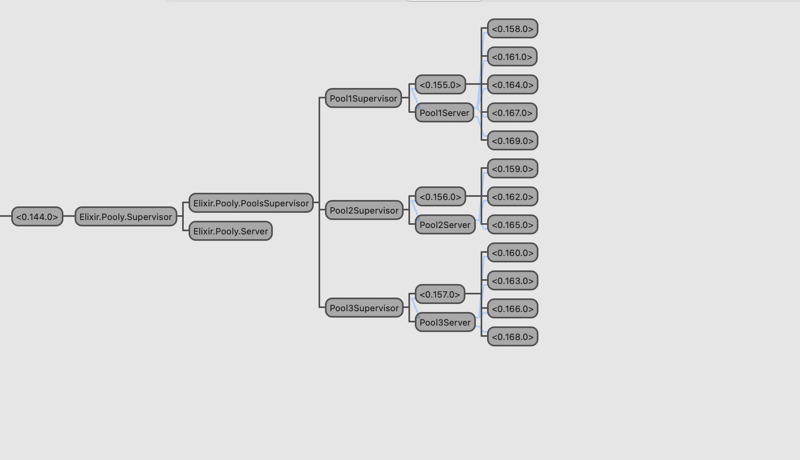

# Pooly

A poolboy concept application

## It for learning purpose

Here is the supervision tree,



The example pool config

```elixir
pool_config = [
      [name: "Pool1", mfa: {Pooly.SampleWorker, :start_link, [[]]}, size: 5],
      [name: "Pool2", mfa: {Pooly.SampleWorker, :start_link, [[]]}, size: 3],
      [name: "Pool3", mfa: {Pooly.SampleWorker, :start_link, [[]]}, size: 4]
    ]
```

## Usage

Checkout a process
```
iex> Pooly.checkout(pool_name)
```

Return/checkin a process
```
iex> Pooly.checkin(pool_name, process_pid)
```

Get the current state of a pool
```
iex> Pooly.status(pool_name)
```